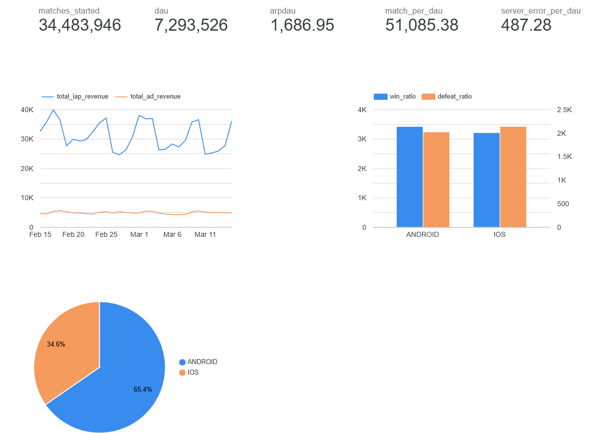

# Vertigo Games - Data Engineer Case Study

> **Version 2.0.0** - Unified project structure (API + DBT)

A comprehensive solution for the Vertigo Games Data Engineer case study, including a **Clan Backend API** (Part 1) and **DBT Analytics Model** (Part 2).

## ⚠️ Note on Previous Repository

The DBT code was previously maintained in a separate repository [`clan-analytics-dbt`](https://github.com/kaanguner/clan-analytics-dbt). **As of v2.0.0, that repository is deprecated.** All code (API + DBT) is now unified in this single repository.

### Version History

| Version | Description |
|---------|-------------|
| **v1.0** | Initial release with API-only in `clan-api` repository |
| **v2.0.0** | Unified API + DBT into single repo (breaking structural change, hence major version bump) |

## 📋 Table of Contents

- [Project Structure](#project-structure)
- [Part 1: Clan Backend API](#part-1-clan-backend-api)
- [Part 2: DBT Model & Visualization](#part-2-dbt-model--visualization)
- [Methodology & Assumptions](#methodology--assumptions)
- [Screenshots](#screenshots)
- [Quick Start](#quick-start)
- [Future Improvements](IMPROVEMENTS.md)

---

## 📁 Project Structure

```
├── api/                          # Part 1: Clan Backend API
│   ├── app/
│   │   ├── main.py              # FastAPI application entry point
│   │   ├── config.py            # Configuration management
│   │   ├── database.py          # Database connection (local + Cloud SQL)
│   │   ├── models.py            # SQLAlchemy ORM models
│   │   ├── schemas.py           # Pydantic request/response schemas
│   │   └── routes/
│   │       └── clans.py         # Clan CRUD endpoints
│   ├── scripts/
│   │   ├── load_sample_data.py  # Sample data loader
│   │   ├── setup_cloud_sql.sh   # Cloud SQL setup script
│   │   └── deploy.sh            # Cloud Run deployment script
│   ├── Dockerfile               # Production Docker image
│   ├── docker-compose.yml       # Local development setup
│   └── requirements.txt
│
├── dbt/                          # Part 2: DBT Analytics
│   ├── dbt_project.yml
│   ├── profiles.yml.example
│   └── models/
│       ├── sources.yml          # Source definitions
│       └── marts/
│           ├── daily_metrics.sql    # Main aggregation model
│           └── schema.yml           # Model documentation & tests
│
├── scripts/
│   └── create_bq_table.py       # BigQuery external table creator
│
├── CHANGELOG.md                  # Version history
├── IMPROVEMENTS.md               # Future optimization ideas
└── README.md
```

---

## 🎮 Part 1: Clan Backend API

A REST API for managing game clans, built with **FastAPI** and deployed on **Google Cloud Run** with **Cloud SQL (PostgreSQL)**.

### 🌐 Live API

| | URL |
|--|-----|
| **Swagger UI** | https://clan-api-1076195585386.europe-west1.run.app/docs |
| **ReDoc** | https://clan-api-1076195585386.europe-west1.run.app/redoc |
| **Health Check** | https://clan-api-1076195585386.europe-west1.run.app/health |

### API Endpoints

| Method | Endpoint | Description |
|--------|----------|-------------|
| `POST` | `/clans` | Create a new clan |
| `GET` | `/clans` | List all clans |
| `GET` | `/clans/search?name=xxx` | Search clans by name (min 3 chars) |
| `DELETE` | `/clans/{id}` | Delete a clan by UUID |

### Clan Schema

```json
{
  "id": "uuid",
  "name": "string (required)",
  "region": "string (e.g., 'TR', 'US')",
  "created_at": "timestamp (UTC, auto-generated)"
}
```

### Local Development

```bash
# Start local PostgreSQL and API with Docker Compose
cd api
docker-compose up -d

# API will be available at http://localhost:8080
# Docs at http://localhost:8080/docs
```

### Deploy to Google Cloud

```bash
# 1. Set up Cloud SQL instance
export GCP_PROJECT_ID="your-project-id"
export GCP_REGION="europe-west1"
./scripts/setup_cloud_sql.sh

# 2. Deploy to Cloud Run
./scripts/deploy.sh
```

### API Examples

```bash
# Create a clan
curl -X POST http://localhost:8080/clans \
  -H "Content-Type: application/json" \
  -d '{"name": "Phoenix Warriors", "region": "TR"}'

# List all clans
curl http://localhost:8080/clans

# Search clans (min 3 characters)
curl "http://localhost:8080/clans/search?name=Phoe"

# Delete a clan
curl -X DELETE http://localhost:8080/clans/{uuid}
```

---

## 📊 Part 2: DBT Model & Visualization

### Data Model: `daily_metrics`

Aggregates user-level daily metrics by **event_date**, **country**, and **platform**.

| Field | Description | Calculation |
|-------|-------------|-------------|
| `dau` | Daily Active Users | `COUNT(DISTINCT user_id)` |
| `total_iap_revenue` | In-app purchase revenue | `SUM(iap_revenue)` |
| `total_ad_revenue` | Ad revenue | `SUM(ad_revenue)` |
| `arpdau` | Avg Revenue Per DAU | `(iap + ad) / dau` |
| `matches_started` | Total matches started | `SUM(match_start_count)` |
| `match_per_dau` | Matches per user | `matches_started / dau` |
| `win_ratio` | Win percentage | `victories / matches_ended` |
| `defeat_ratio` | Defeat percentage | `defeats / matches_ended` |
| `server_error_per_dau` | Errors per user | `server_errors / dau` |

### BigQuery Setup

```bash
# 1. Create BigQuery dataset
bq mk --location=europe-west1 vertigo_raw

# 2. Upload CSV data to BigQuery
# Uncompress CSV files and upload using bq load or Cloud Console

# 3. Configure DBT profile (copy profiles.yml.example to ~/.dbt/profiles.yml)

# 4. Run DBT
cd dbt
dbt run
```

### Visualization

Dashboard created in **Looker Studio** showing:
- Daily Active Users trend
- Revenue breakdown (IAP vs Ad)
- ARPDAU over time
- Win/Defeat ratios by platform
- Platform distribution

📊 **[View Live Dashboard](https://lookerstudio.google.com/reporting/15107180-9e15-4fa5-9517-2fea4a952a65)**

---

## 📸 Screenshots

### Looker Studio Dashboard



*Dashboard showing DAU (7.3M), Matches Started (34.5M), ARPDAU (1,686), Revenue Trends, Platform Split, and Win/Defeat Ratios.*

---

## 🔬 Methodology & Assumptions

### Data Quality Considerations

1. **Missing Country Values**: Rows with NULL or empty country are mapped to `'UNKNOWN'`
2. **Platform Normalization**: Platform values are uppercased (ANDROID/IOS)
3. **Division by Zero**: All ratio calculations handle zero denominators gracefully
4. **UTC Timestamps**: All timestamps stored and processed in UTC

### Design Decisions

1. **FastAPI over Flask**: Chosen for automatic OpenAPI docs, async support, and type validation
2. **UUID Primary Keys**: Using UUID v4 for clan IDs to prevent enumeration attacks
3. **Cloud SQL Connector**: Uses Google's official connector for secure Cloud Run integration
4. **DBT Partitioning**: Model is partitioned by event_date for efficient querying

### A Note on DBT & Containerization

> **Why isn't DBT separately dockerized?**
>
> In enterprise data engineering (e.g., at Booking.com), DBT typically runs as a **CLI tool inside orchestrated containers** rather than having its own standalone Dockerfile. The pattern is:
>
> - **Local Development**: DBT runs inside VS Code Dev Containers with pre-configured tooling
> - **Production**: Kubernetes orchestrators (Airflow, WFM) execute DBT as containerized jobs, where the container image includes dbt-core and the project code is mounted via CI/CD
>
> For this case study, DBT executes against **BigQuery** (a serverless warehouse), meaning the compute happens server-side. Containerizing DBT would add operational overhead without meaningful benefit—the SQL transformation logic is what matters, not the thin CLI wrapper.
>
> The API, by contrast, is a **long-running service** that must be deployed as a container to Cloud Run. This distinction drives the architecture: **services get Dockerfiles, batch CLI tools get orchestrated**.

### Assumptions

- Users can appear in multiple countries/platforms on the same day (aggregated separately)
- Win + Defeat may not equal match_end_count (draws, disconnects exist)
- Server errors are counted regardless of session status

---

## 🚀 Quick Start

### Prerequisites

- Docker & Docker Compose
- Python 3.11+
- Google Cloud SDK (`gcloud`)
- DBT Core with BigQuery adapter

### Installation

```bash
# Clone repository
git clone https://github.com/kaanguner/clan-api.git
cd vertigo-games-case

# Part 1: Start local API
cd api
docker-compose up -d

# Part 2: Run DBT model (requires BigQuery setup)
cd ../dbt
dbt deps
dbt run
```

---

## 📄 License

This project is part of a case study for Vertigo Games.

---

**Author**: Kaan Guner  
**Version**: v2.0.0
